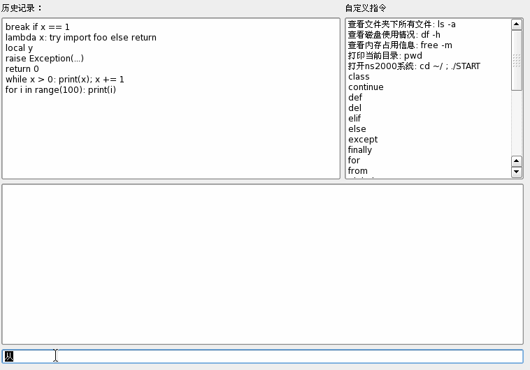

A Qt widget like terminal in Linux, subclass of QLineEdit, for entering commands, with features common in modern shells such as TAB-completion, history, history-search.
You can custom your own command

Use the widget just like a `QLineEdit` widget.

Signals:
 - execute(const QString &cmd)` emitted when Return is pressed with some text typed in;
 - askCompletion(const QString &cmd, int cursorPos)` emitted when Tab is pressed;
 - escape()` emitted when Esc is pressed and the field is empty.

Slots:

 - setHistory(const QStringList &history)` for setting the history (the history is not managed by the widget, it must be maintained by the host application, e.g.: in reaction to the `execute(const QString &cmd)` signal, the command is executed, it is also appended to the history list, and `setHistory(const QStringList &history)` is called to sync the widget's history);
 - setCompletion(const QStringList &completion)` for setting the list of completion (in reaction to `askCompletion(const QString &cmd, int cursorPos)` signal);
 - acceptCompletion()` accepts the current completion (selected text); bound to Return key;
 - cancelCompletion()` discards the current completion (selected text); bound to Esc key;
 - setToolTipAtCursor(const QString &tip)` show a tooltip placed at cursor position (useful for implementing calltips).
